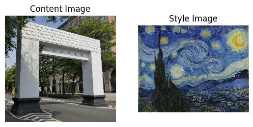
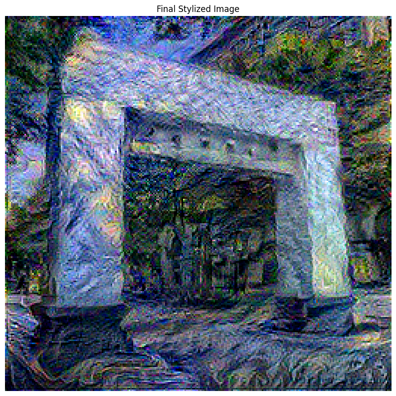

# 🎨 AI 神經風格轉換 (Neural Style Transfer)

這是一個使用 Keras 和 TensorFlow 實現的神經風格轉換專案。它可以將一張內容圖片與一張風格圖片結合，生成一張全新藝術作品。

## 專案介紹

本專案是利用預訓練的 VGG19 卷積神經網路 (CNN) 來提取圖片的特徵。我們定義了兩種損失函數：

1.  **內容損失 (Content Loss)**：確保生成的圖片在內容上與原始內容圖片相似。
2.  **風格損失 (Style Loss)**：透過計算特徵圖的 "Gram 矩陣"，來確保生成的圖片在筆觸、紋理和色彩上接近風格圖片。

模型透過不斷優化一張從雜訊或內容圖片開始的畫布，使其總損失（內容損失 + 風格損失）最小化，最終創作出獨一無二的藝術圖片。

## 效果展示

1.  **原始圖片和風格圖片**：  
   
2.  **經過風格轉換的圖片**：  
   
  
## 如何使用

1.  **環境設定**：
    建議在 Google Colab 上運行，並啟用 GPU 加速。

2.  **準備圖片**：
    - 將你的內容圖片命名為 `content.jpg`。
    - 將你選擇的風格圖片命名為 `style.jpg`。

3.  **運行程式**：
    - 將圖片與 `.ipynb` 筆記本上傳至同一個目錄。
    - 依序執行 Colab 儲存格即可開始訓練。

4.  **調整參數**：
    - 你可以嘗試更換不同的內容和風格圖片。
    - 在程式碼中調整 `style_weight` 和 `content_weight` 的比例，可以改變風格化的強度。

## 使用的技術

- **Python 3**
- **TensorFlow / Keras**: 核心深度學習框架
- **VGG19**: 用於特徵提取的預訓練模型
- **NumPy**: 進行數值運算
- **Pillow / Matplotlib**: 用於圖片處理與顯示
